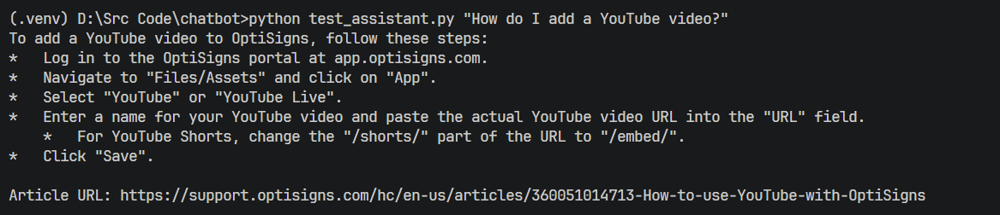

# Chatbot Clone

This project scrapes 30 Zendesk Help Center articles, converts them to clean Markdown, chunks the content, and uploads only changed chunks to a Gemini File Search Store.

## Setup

```bash
git clone https://github.com/iamkvnn/chatbot.git
cd chatbot

python -m venv .venv
.venv\Scripts\activate
pip install -r requirements.txt
```

Create `.env`:

```env
GEMINI_API_KEY=your_key_here

# Optional public last-run artefact on DigitalOcean Spaces
DO_SPACES_KEY=your_spaces_access_key
DO_SPACES_SECRET=your_spaces_secret_key
DO_SPACES_BUCKET=your_bucket_name
DO_SPACES_REGION=sgp1
DO_SPACES_PREFIX=chatbot
DO_SPACES_PUBLIC_BASE_URL=https://your_bucket_name.sgp1.digitaloceanspaces.com
```

If the DigitalOcean Spaces variables are set, each `python main.py` run uploads `data/last_run.json` to:

```text
https://<bucket>.<region>.digitaloceanspaces.com/<prefix>/last_run.json
```

## Run Locally

Run the full scraper and uploader:

```bash
python main.py
```

Run once with Docker:

```bash
docker build -t chatbot .
docker run --rm -e GEMINI_API_KEY="your_key_here" chatbot
```

The Docker container runs `python main.py` once and exits with code `0` when successful.

Run a quick assistant test:

```bash
python test_assistant.py "How do I add a YouTube video?"
```

## Chunking Strategy

- Articles are fetched from the Zendesk Help Center API with `per_page=30`.
- HTML is cleaned and converted to Markdown.
- Internal support links are preserved as relative links.
- Headings, code blocks, and `Article URL` metadata are kept.
- Manual chunk target: `430` content tokens.
- Manual overlap: `40` tokens.
- Gemini upload chunk limit: `512` tokens.
- Gemini upload overlap: `50` tokens.

Delta upload is stateless. The job compares local `chunk_hash` values with chunk metadata already stored in Gemini:

- Same hash: skip.
- New chunk: upload.
- Changed chunk: delete old chunk document, then upload the new one.
- Removed chunk: delete the old Gemini document.

## Last Run Log

```text
https://chatbottest.sgp1.digitaloceanspaces.com/chatbot/last_run.json
```

## Assistant Screenshot

Sample question:

```text
How do I add a YouTube video?
```


